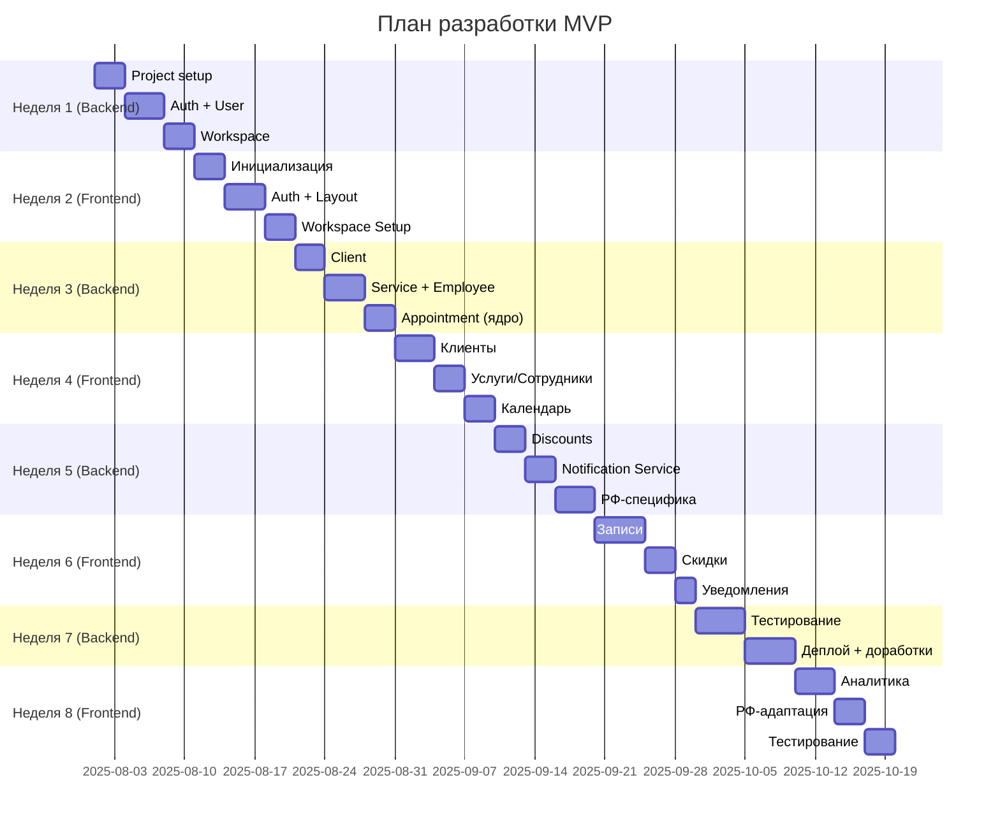

### 🚀 Общий план (8 недель, 240-320 часов)

```mermaid
gantt
    title План разработки MVP
    dateFormat  YYYY-MM-DD

    section Неделя 1 (Backend)
    Project setup           :a1, 2025-08-01, 3d
    Auth + User             :a2, after a1, 4d
    Workspace               :a3, after a2, 3d

    section Неделя 2 (Frontend)
    Инициализация           :b1, 2025-08-11, 3d
    Auth + Layout           :b2, after b1, 4d
    Workspace Setup         :b3, after b2, 3d

    section Неделя 3 (Backend)
    Client                  :c1, 2025-08-21, 3d
    Service + Employee      :c2, after c1, 4d
    Appointment (ядро)      :c3, after c2, 3d

    section Неделя 4 (Frontend)
    Клиенты                 :d1, 2025-08-31, 4d
    Услуги/Сотрудники       :d2, after d1, 3d
    Календарь               :d3, after d2, 3d

    section Неделя 5 (Backend)
    Discounts               :e1, 2025-09-10, 3d
    Notification Service    :e2, after e1, 3d
    РФ-специфика            :e3, after e2, 4d

    section Неделя 6 (Frontend)
    Записи                  :f1, 2025-09-20, 5d
    Скидки                  :f2, after f1, 3d
    Уведомления             :f3, after f2, 2d

    section Неделя 7 (Backend)
    Тестирование            :g1, 2025-09-30, 5d
    Деплой + доработки      :g2, after g1, 5d

    section Неделя 8 (Frontend)
    Аналитика               :h1, 2025-10-10, 4d
    РФ-адаптация            :h2, after h1, 3d
    Тестирование            :h3, after h2, 3d
```
