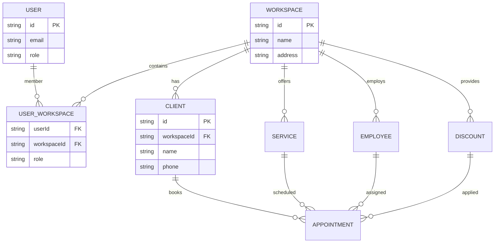

### 🚀 Первый релиз MVP

**Минимально жизнеспособный функционал:**

1. Регистрация владельца бизнеса
2. Создание Workspace (салона)
3. Добавление услуг и сотрудников
4. Онлайн-запись клиентов
5. Базовые уведомления (email)
6. Простые скидки (промокоды)

---

### ✅ Детальный чек-лист по неделям

**Неделя 1: Базис и Workspace (30 часов)**

- [~] **Инициализация (5ч)**

  - [x] Установка Bun + TS
  - [~] Настройка ESLint/Prettier
  - [x] Конфигурация Drizzle ORM
  - [x] Миграции для базовых таблиц

- [~] **Аутентификация (10ч)**

  - [x] Better Auth интеграция
  - [x] Регистрация/логин эндпоинты
  - [ ] Сущность User (id, email, role)
  - [ ] Value Object: Email
  - [ ] RBAC (роли: owner, admin, employee)
  - [ ] Integrate [better-auth-telegram plugin](https://github.com/vitalygashkov/telegram-better-auth/blob/main/src/index.ts)

- [ ] **Workspace (15ч)**
  - [ ] Интеграция [better-auth/organization](https://www.better-auth.com/docs/plugins/organization)
  - [ ] Сущность Workspace (id, name, address, timezone)
  - [ ] Связь User-Workspace (многие-ко-многим)
  - [ ] Use Case: CreateWorkspace
  - [ ] Use Case: AddUserToWorkspace
  - [ ] Эндпоинты:
    - POST /workspaces
    - POST /workspaces/:id/members
    - GET /workspaces/my
  - [ ] Валидация: проверка прав доступа

**Неделя 2: Клиенты и Записи (40 часов)**

- [ ] **Клиенты (12ч)**

  - [ ] Сущность Client (id, name, phone, email, workspaceId)
  - [ ] Value Object: Phone (российский формат)
  - [ ] Репозиторий: ClientRepository
  - [ ] Use Case: CreateClient
  - [ ] Use Case: UpdateClient
  - [ ] Эндпоинты:
    - POST /clients
    - PATCH /clients/:id
    - GET /workspaces/:id/clients

- [ ] **Услуги и Сотрудники (10ч)**

  - [ ] Сущность Service (id, name, duration, price, workspaceId)
  - [ ] Сущность Employee (id, name, position, workspaceId)
  - [ ] Связь Service-Employee (многие-ко-многим)
  - [ ] Базовые CRUD операции

- [ ] **Записи (Appointments) (18ч)**
  - [ ] Сущность Appointment (id, clientId, serviceId, employeeId, workspaceId, startTime, status)
  - [ ] Value Object: TimeSlot
  - [ ] Use Case: CreateAppointment
    - [ ] Проверка доступности слота
    - [ ] Валидация пересечений
  - [ ] Use Case: CancelAppointment
  - [ ] Use Case: FindAvailableSlots
  - [ ] Эндпоинты:
    - POST /appointments
    - PATCH /appointments/:id/cancel
    - GET /appointments/available-slots

**Неделя 3: Скидки и Интеграции (35 часов)**

- [ ] **Скидки (15ч)**

  - [ ] Сущность Discount (id, code, type, value, validFrom, validUntil, workspaceId)
  - [ ] Типы скидок: процент/фиксированная/праздничная
  - [ ] Use Case: ApplyDiscountToAppointment
  - [ ] Use Case: CreateDiscountRule
  - [ ] Валидация: срок действия, мин. сумма
  - [ ] Эндпоинты:
    - POST /discounts
    - POST /appointments/:id/apply-discount

- [ ] **Уведомления (10ч)**

  - [ ] Сервис NotificationService
  - [ ] Адаптеры:
    - [ ] Email (Nodemailer)
    - [ ] SMS (SMS.ru заглушка)
    - [ ] Telegram Bot
  - [ ] Шаблоны уведомлений:
    - [ ] Подтверждение записи
    - [ ] Напоминание за 24ч
    - [ ] Отмена записи

- [ ] **РФ-специфика (10ч)**
  - [ ] Таймзона Europe/Moscow
  - [ ] Валидация телефонов (+7 формат)
  - [ ] Документы по 152-ФЗ:
    - [ ] Политика конфиденциальности
    - [ ] Обработка персональных данных
  - [ ] Интеграция с SMS.ru (заглушка)

**Неделя 4: Тестирование и Деплой (35 часов)**

- [ ] **Тестирование (20ч)**

  - [ ] Юнит-тесты доменных моделей:
    - [ ] Workspace
    - [ ] Appointment
    - [ ] Discount
  - [ ] Интеграционные тесты:
    - [ ] Auth flow
    - [ ] Создание записи
    - [ ] Применение скидки
  - [ ] Тесты безопасности:
    - [ ] Проверка RBAC
    - [ ] Изоляция данных между workspace
  - [ ] E2E тесты ключевых сценариев

- [ ] **Деплой и РФ-инфраструктура (15ч)**
  - [ ] Настройка Yandex Cloud
  - [ ] Деплой PostgreSQL (Selectel)
  - [ ] HTTPS (Let's Encrypt)
  - [ ] Настройка бэкапов
  - [ ] Мониторинг (логи, метрики)
  - [ ] Документация API (Swagger)

---

### 🏗️ Архитектурная схема с Workspace



---

### 🔑 Ключевые зависимости для Workspace

1. **Изоляция данных**:

```typescript
// В репозиториях
async findByWorkspace(workspaceId: string) {
  return db.select().from(clients)
    .where(eq(clients.workspaceId, workspaceId));
}
```

2. **Проверка доступа**:

```typescript
// В middleware
const userCanAccessWorkspace = (user: User, workspaceId: string) => {
  return user.workspaces.some((ws) => ws.id === workspaceId);
};
```

3. **Временные зоны**:

```typescript
// Хранение времени в UTC
const appointmentTime = new Date().toISOString();

// Отображение в локальном времени
const localTime = utcToZonedTime(appointmentTime, workspace.timezone);
```
